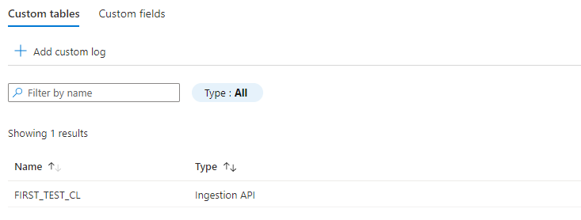
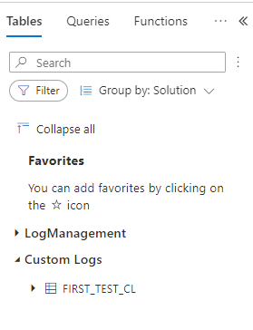

# Azure log

The application will send logfiles to Log Analytics Workspace for better analysing. The microsoft
doc can be
found [here](https://docs.microsoft.com/en-us/azure/azure-monitor/logs/data-collector-api). For
application to run we need to provide the following properties.

```properties
# Azure properties you can find both values below "Agent Management"
# Workspace ID
app.azure.workspaceId=
# primary or the secondary Connected Sources client authentication key
app.azure.connectionKey=
```

## Log configuration

Let's parse the following access log statements (you can find full
log [here](src/test/resources/logs/http-access.log)):

```log
127.0.0.2 - - [27/Apr/2022:22:04:08 +0000] "GET /dynamic-packages.json?_dc=1651097048052 HTTP/1.1" 200 611 "https://domain.com/" "Mozilla/5.0 (Windows NT 10.0; Win64; x64; rv:99.0) Gecko/20100101 Firefox/99.0" "127.0.1.0"
127.0.0.3 - - [27/Apr/2022:22:04:10 +0000] "GET /packages/utils-studio/package.json?_dc=1651097050198 HTTP/1.1" 200 1685 "https://domain.com/" "Mozilla/5.0 (Windows NT 10.0; Win64; x64; rv:99.0) Gecko/20100101 Firefox/99.0" "127.0.1.0"
```

We split the first line and create a regex for it:

| Log Value                   | Description      | Regex                     |
|:----------------------------|:-----------------|:--------------------------|
| 127.0.0.2                   | load balancer IP | `(?<HostIp>[0-9.-]+)`     |
| 27/Apr/2022:22:04:08 +0000  | timestamp        | `\[(?<TimeGenerated>.+)]` |
| GET                         | method           | `(?<Method>[A-Z]+)`       |
| /dynamic-packages.json[...] | path             | `(?<Path>.+)`             |
| 200                         | status Code      | `(?<StatusCode>\d+)`      |
| 611                         | request duration | `(?<Duration>\d+)`        |
| "https://domain.com/"       | domain           | `"(?<Domain>.+)"`         |
| Mozilla/5.0 [...]           | user agent       | `"(?<Agent>.+)"`          |
| 127.0.1.0                   | status Code      | `"(?<ClientIp>[0-9-.]+)"` |

Based on that we can create a request

```json
{
  "path": "/my/log/path.log",
  "pattern": "(?<HostIp>[0-9.-]+) - - \\[(?<Timestamp>.+)] \"(?<Method>[A-Z]+) (?<Path>.+) HTTP/1.1\" (?<StatusCode>\\d+) (?<Duration>\\d+) \"(?<Domain>.+)\" \"(?<Agent>.+)\" \"(?<ClientIp>[0-9-.]+)\"",
  "timestampFieldName": "Timestamp",
  "timestampPattern": "dd/MMM/yyyy:HH:mm:ss ZZZZ"
}
```

Or you can use the provided [addLog.rest](src/test/java/com/vscoding/azure/log/core/boundary/addLog.rest).
After executing it we can navigate to "Log Analytics Workspace" and select in the sidebar _Custom
Logs_ (inside Settings Tab). You will see your log immediately displayed there



When switching to the _Logs_ view you will see your log as table below _Custom Logs_ (it may take
some time, until it is displayed ~10-15 Minutes).



Now you can query your logs.

## Notes

### time-generated-field

There is a way to make your log time written as `TimeGenerated` (
see [here](https://docs.microsoft.com/en-us/azure/azure-monitor/logs/data-collector-api#request-headers))

> The name of a field in the data that contains the timestamp of the data item. If you specify a field, its contents are used for TimeGenerated. If you don't specify this field, the default for TimeGenerated is the time that the message is ingested. The contents of the message field should follow the ISO 8601 format YYYY-MM-DDThh:mm:ssZ. Note: the Time Generated value cannot be older than 3 days before received time or the row will be dropped.

I was not able to make it work, even when the date was correctly formatted, it still kept getting
the wrong `TimeGenerated` value. So I will comment out the header (if I don't azure just drops
the `Timestamp`) field.
